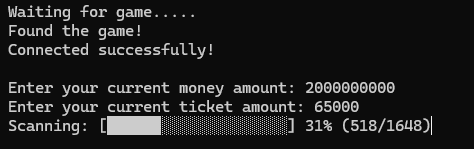

# FrostyFunds

Modify money and ticket values in the [Sledding Game Demo](https://store.steampowered.com/app/3438850/Sledding_Game/).

- Modify both money and tickets at the same time
- Tiny download (under 600KB), no installation needed
- Simple prompts guide you through the process

## Download

Or visit the [Releases page](https://github.com/Stuie/FrostyFunds/releases) for all versions.

## How to Use

1. Download `FrostyFunds.exe` and run it alongside **Sledding Game Demo**
2. Enter your current money and ticket amounts
3. Do something in-game to change them (buy, sell, spin the wheel)
4. Enter the new amounts
5. Enter your desired amounts
6. Do something in-game again to see your new values

## Note

The money in Sledding Game Demo is only used for purchasing cosmetic items. This tool is for educational purposes and personal experimentation.

**Make sure to [Wishlist the game on Steam](https://store.steampowered.com/app/3438850/Sledding_Game/)!**

---

For developers: See [DEVELOPMENT.md](DEVELOPMENT.md) for build instructions and architecture details.

[MIT License](LICENSE)
